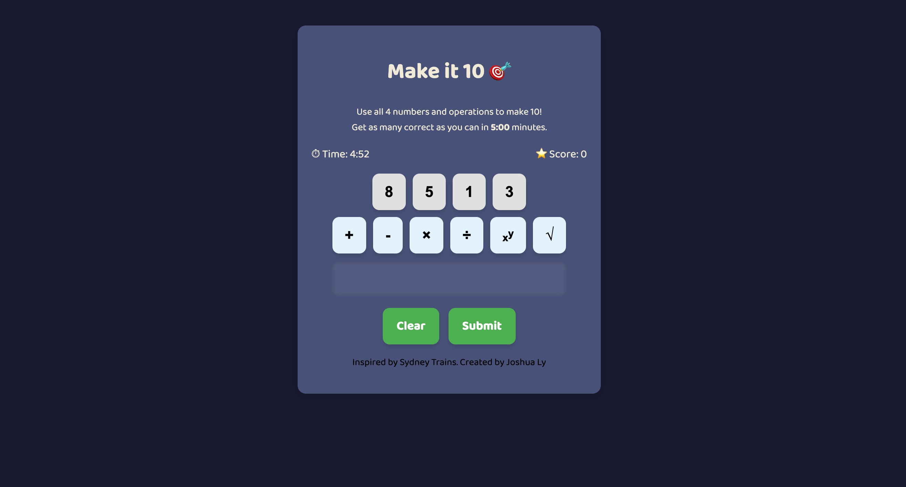

# Make It 10 🎯

**Make It 10** is a fast-paced arithmetic puzzle game built with HTML, CSS, and JavaScript. Players are given four random digits and must use every digit exactly once, combined with addition, subtraction, multiplication, division, exponentiation, or square root, to form an expression that evaluates to 10. The player has 5 minutes to solve as many puzzles as possible, with each correct solution resetting the current digit set.

## Table of Contents

* [Demo](#demo)
* [Features](#features)
* [Getting Started](#getting-started)

  * [Prerequisites](#prerequisites)
  * [Installation](#installation)
  * [Running the Game](#running-the-game)
* [Usage & Controls](#usage--controls)
* [Customisation](#customisation)
* [Feedback](#Feedback)
* [Author](#author)

---

## Demo
### [Live URL Here]()


---

## Features

* **Endless Mode**: 5-minute countdown to solve as many 4-digit puzzles as you can.
* **Six Operations**: `+`, `-`, `×`, `÷`, power (`ⁿ`), and square root (`√`).
* **Keyboard + Mouse**: Click or type digits/operators; `Enter` submits; `Backspace` deletes.
* **Responsive Design**: Works on desktop and mobile browsers.

---

## Getting Started

### Prerequisites

* A modern web browser (Chrome, Firefox, Safari, Edge)
* A local HTTP server (optional but recommended)

### Installation

1. **Clone the repository**

   ```bash
   git clone https://github.com/Joshua-Ly/make-it-10
   cd make-it-10
   ```

2. **Serve via HTTP**

   ```bash
   # Python 3
   python -m http.server 8000

   # Node.js (http-server)
   npm install -g http-server
   http-server -c-1 .
   ```

### Running the Game

* **Directly**: Open `index.html` in your browser.
* **Via HTTP**: Navigate to `http://localhost:8000/index.html`.

---

## Usage & Controls

* **Select Digit**: Click a digit button or press its key.
* **Select Operation**: Click the operator or type `+`, `-`, `*`, `/`, `^` (power 2), `r` (√).
* **Submit**: Click **Submit** or press **Enter**.
* **Clear**: Click **Clear** or press **Backspace** to remove last entry.
* **Timer**: Counts down from 5:00; game ends at 0:00.
* **Score**: +1 for each unique correct expression (must use all 4 digits).

---

## Customisation

* **Game Duration**: In `script.js`, adjust `const TOTAL_TIME` (in seconds).
* **Digit Range**: Change the random digit generator (1–9) in `loadNewDigits()`.

---

## Feedback

I love receiving feedback, doing so with open arms. If there are any additonal feature that should bea added to improvide functionaltiy and overall experience for the user, feel free to email me at lyjoshua8@gmail.com.

---

## Author

**Joshua Ly**
Inspired by Sydney Trains

---
